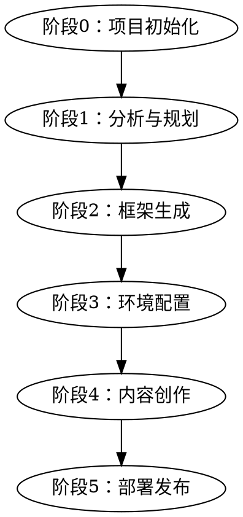
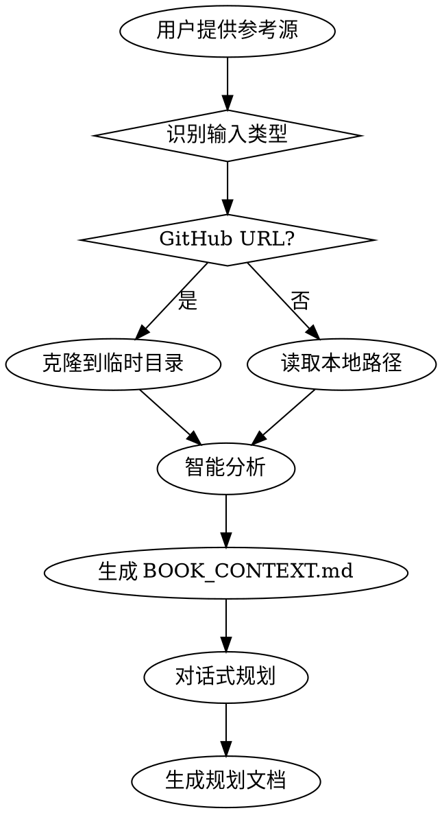
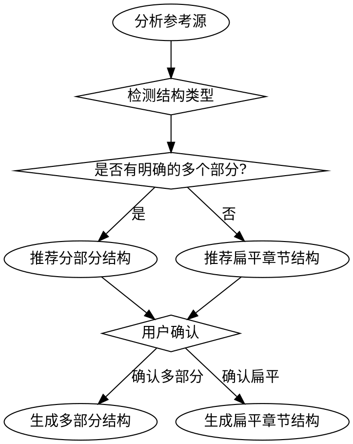
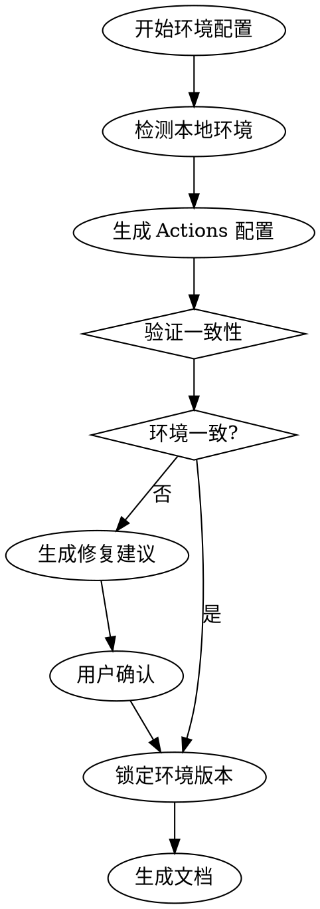
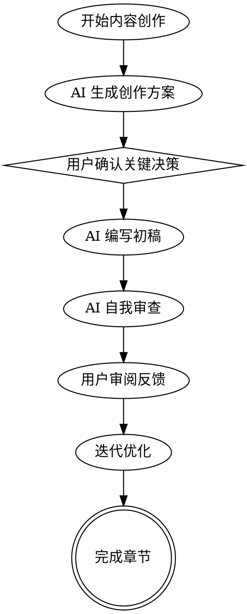
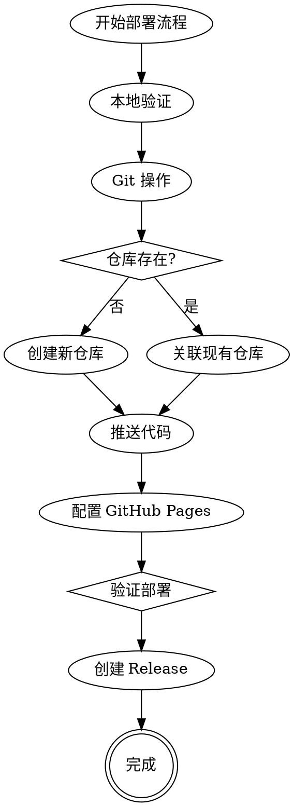

# Book Crafter Skill 设计文档

**版本**: 1.0.0
**创建日期**: 2026-03-24
**作者**: Claude & User

---

## 目录

1. [概览](#1-概览)
2. [架构设计](#2-架构设计)
3. [详细工作流程](#3-详细工作流程)
4. [数据流设计](#4-数据流设计)
5. [Skill 文件结构](#5-skill-文件结构)
6. [技术实现细节](#6-技术实现细节)
7. [环境问题知识库](#7-环境问题知识库)
8. [测试计划](#8-测试计划)
9. [部署和使用流程](#9-部署和使用流程)
10. [总结和优势](#10-总结和优势)

---

## 1. 概览

### 1.1 核心价值

**Book Crafter** 是一个 AI 驱动的智能书籍创作 Skill，提供从参考源分析到 GitHub 部署的全流程支持。

**关键特性**：
- 📥 **灵活输入**：支持 GitHub URL 和本地路径作为参考源
- 🏗️ **清晰流程**：5 阶段结构化工作流
- 🔧 **智能环境诊断**：自动检测和修复环境问题
- ✍️ **AI 专家协作**：深度理解项目，主动提供创作建议
- 🚀 **一键部署**：自动配置 GitHub Pages 和 Release
- 🌍 **跨语言创作**：支持英文参考源直接生成中文书籍

**定位**：作为 "The Guild（公会）" 的首个 Skill，存放在 `~/Github/the-guild/skills/book-crafter/`

### 1.2 核心创新

1. **BOOK_CONTEXT.md** - AI 的项目理解文档，类似 CLAUDE.md
2. **环境一致性保障** - 确保 Node.js 版本、依赖、平台配置在本地和 GitHub Actions 完全一致
3. **关键节点征询** - AI 只在战略级决策征询用户，细节自主决策
4. **直接创作模式** - 跨语言内容生成，避免翻译腔

---

## 2. 架构设计

### 2.1 整体架构

```
Book Crafter 架构层次：

┌─────────────────────────────────────────────┐
│          用户交互层 (Interaction)            │
│  • 命令行对话                                │
│  • 进度可视化                                │
│  • 验证点确认                                │
└─────────────────────────────────────────────┘
                    ↓
┌─────────────────────────────────────────────┐
│          流程控制层 (Workflow Engine)          │
│  • 5 阶段工作流管理                          │
│  • 状态机控制                                │
│  • 阶段切换和回退                            │
└─────────────────────────────────────────────┘
                    ↓
┌─────────────────────────────────────────────┐
│          智能分析层 (Intelligence)             │
│  • 参考源分析                                │
│  • 内容结构提取                              │
│  • 技术栈识别                                │
│  • 智能建议生成                              │
└─────────────────────────────────────────────┘
                    ↓
┌─────────────────────────────────────────────┐
│          环境管理层 (Environment)              │
│  • 系统环境检测                              │
│  • 依赖安装和修复                            │
│  • 构建工具配置                              │
│  • CI/CD 配置                               │
└─────────────────────────────────────────────┘
                    ↓
┌─────────────────────────────────────────────┐
│          内容协作层 (Content)                  │
│  • 内容生成辅助                              │
│  • 章节编号修复                              │
│  • 格式检查                                  │
│  • 实时反馈                                  │
└─────────────────────────────────────────────┘
                    ↓
┌─────────────────────────────────────────────┐
│          部署发布层 (Deployment)               │
│  • Git 操作                                  │
│  • GitHub API 集成                          │
│  • GitHub Pages 配置                        │
│  • Release 自动化                           │
└─────────────────────────────────────────────┘
```

### 2.2 核心模块

| 模块名称 | 职责 | 关键技术 |
|---------|------|---------|
| **InputHandler** | 输入识别和验证 | 路径解析、URL 解析、Git 操作 |
| **WorkflowEngine** | 工作流控制 | 状态机、阶段管理 |
| **ReferenceAnalyzer** | 参考源分析 | 文件系统扫描、内容解析、语言检测 |
| **EnvironmentManager** | 环境管理 | Shell 命令、依赖检测、一致性验证 |
| **ContentCollaborator** | 内容协作 | AI 生成、文本处理、跨语言创作 |
| **DeployManager** | 部署管理 | Git、GitHub API、CI/CD |

### 2.3 数据流

```
用户输入 → InputHandler → WorkflowEngine
                              ↓
                    ReferenceAnalyzer (阶段一)
                              ↓
                    框架生成器 (阶段二)
                              ↓
                    EnvironmentManager (阶段三)
                              ↓
                    ContentCollaborator (阶段四)
                              ↓
                    DeployManager (阶段五)
                              ↓
                          部署完成
```

---

## 3. 详细工作流程

### 3.1 工作流总览



### 3.2 阶段零：项目初始化

**目标**：确定新书项目的输出位置

**输入**：
- 用户指定的本地路径（必需）

**处理流程**：
1. 展开路径（处理 `~` 等）
2. 检查路径是否存在
3. 如果存在：
   - 空目录 → 直接使用
   - 非空目录 → 提供选项（清空/增量/重新选择）
4. 如果不存在 → 创建目录

**输出**：
- 确认的项目路径
- 初始化的 Git 仓库（可选）

**验证点**：
- ✅ 路径有效且可写
- ✅ Git 可用（如果选择初始化）

### 3.3 阶段一：分析与规划

**目标**：分析参考源并规划新书方向

**输入**：
- 参考源（可选）：GitHub URL 或本地路径

**处理流程**：



**智能分析内容**：
- 书籍类型识别（教程/手册/案例/技术文档）
- 章节结构提取
- 技术栈检测（VitePress/GitBook/Docusaurus）
- 特色功能识别（PDF生成、搜索、多语言等）
- ⭐ **语言检测**：识别参考源语言，确定创作策略
- 内容质量评估

**对话式规划问题**：
1. 书籍主题和核心价值
2. 目标读者群体
3. 内容风格偏好
4. 特殊需求和定制

**输出**：
- **BOOK_CONTEXT.md** - AI 的项目理解文档（核心）
- 参考源分析报告（JSON + Markdown）
- 书籍规划文档（包含目标、读者、风格、需求）

**验证点**：
- ✅ 参考源分析完成
- ✅ 规划文档用户确认
- ✅ BOOK_CONTEXT.md 生成

### 3.4 阶段二：框架生成

**目标**：生成书籍项目骨架和配置文件

**输入**：
- 项目路径
- 书籍规划文档
- BOOK_CONTEXT.md

**处理流程**：



**智能结构识别**：
- 参考源有 `part-*` 目录 → 分部分结构
- 参考源章节数 > 10 → 建议分部分（用户确认）
- 参考源章节数 ≤ 10 → 扁平章节（默认）
- 从零开始 + 用户选择 → 遵循用户选择

**生成内容**：
1. 生成章节大纲（基于参考源 + 规划文档）
2. 创建文件夹结构
3. 生成配置文件
4. 创建初始文档模板
5. 生成辅助脚本

**输出**：
- 完整的项目骨架
- 配置文件（package.json, VitePress config等）
- 辅助脚本（PDF生成、编号修复等）

**验证点**：
- ✅ 文件夹结构合理
- ✅ 配置文件完整
- ✅ 本地构建测试通过

### 3.5 阶段三：环境配置

**目标**：配置开发环境，解决依赖和构建问题

**输入**：
- 项目路径
- 技术栈信息（从阶段一获取）

**核心原则**：**本地环境 = GitHub Actions 环境**

**处理流程**：



**环境一致性检查清单**：

1. **Node.js 版本锁定**
   - 检测本地 Node.js 版本
   - 在 GitHub Actions 中锁定相同版本
   - 生成验证脚本

2. **依赖版本锁定**
   - 确保 package-lock.json 存在
   - Actions 使用 `npm ci` 严格安装

3. **平台依赖同步**
   - 本地：macOS (darwin-arm64)
   - Actions：Ubuntu (linux-x64)
   - 自动配置跨平台依赖

4. **Puppeteer 环境同步**
   - 配置 Chrome 安装
   - 设置环境变量

**输出**：
- 环境配置报告
- GitHub Actions workflow 文件
- 环境一致性验证脚本
- ENVIRONMENT.md 文档

**验证点**：
- ✅ Node.js 版本符合要求
- ✅ 所有依赖正确安装
- ✅ 本地构建测试通过
- ✅ 本地预览可用
- ✅ 环境一致性验证通过

### 3.6 阶段四：内容创作

**目标**：AI 辅助内容创作，用户主导、Skill 辅助

**核心理念**：**AI 先深入理解项目，成为专家，然后主动给灵感和建议，只在关键节点征询用户确认**

**输入**：
- 书籍框架
- BOOK_CONTEXT.md（核心）
- 参考源内容（如果有）
- 用户编写的内容

**AI 专家角色**：

基于 BOOK_CONTEXT.md，AI 扮演领域专家：
- 理解项目目标和风格
- 熟悉目标读者
- 掌握创作原则
- 能做出合理决策

**工作流程**：



**关键节点识别**：

AI 自动识别哪些是需要征询用户的关键节点：

| 节点类型 | 示例 | AI 行为 |
|---------|------|---------|
| **战略决策** | 书籍整体方向、目标读者调整 | **必须征询** |
| **架构设计** | 章节组织方式、内容深度 | **必须征询** |
| **风格定位** | 文字风格、代码示例风格 | 首次征询，后续遵循 |
| **内容取舍** | 某些主题是否包含 | **必须征询** |
| **技术选型** | 工具推荐、版本选择 | **必须征询** |
| **细节实现** | 具体代码示例、措辞 | **AI 自主决定** |
| **格式规范** | Markdown 格式、章节编号 | **AI 自动处理** |

**跨语言内容生成**：

参考源为英文，创作目标为中文书籍时，采用**直接创作模式**：

1. AI 深度理解英文内容
2. 建立知识图谱和概念模型
3. 用中文思维重新组织内容
4. 生成符合中文表达习惯的书籍

**创作原则**：
- 理解优先：深度理解原意，而非翻译
- 表达地道：符合中文习惯
- 案例本土化：使用中文读者熟悉的案例
- 术语规范化：专业术语保留英文或使用标准译名
- 参考链接：提供英文原文链接

**输出**：
- 完整的书籍内容
- 质量检查报告
- 修复后的章节编号

**验证点**：
- ✅ 所有章节内容完整
- ✅ Markdown 格式正确
- ✅ 章节编号连续
- ✅ 链接有效
- ✅ 本地预览正常

### 3.7 阶段五：部署发布

**目标**：自动化部署到 GitHub Pages 和发布 Release

**输入**：
- 完整的书籍项目（内容 + 配置）
- 用户 GitHub 仓库信息

**处理流程**：



**部署步骤**：

1. **本地验证**
   - 构建测试
   - 本地预览测试
   - PDF 生成测试（可选）

2. **Git 操作**
   - 提交所有更改
   - 配置远程仓库
   - 推送代码

3. **GitHub Pages 配置**
   - 启用 GitHub Pages
   - 设置 Source 为 GitHub Actions
   - 等待 Actions 部署

4. **验证部署**
   - 网站可访问
   - 页面正常显示
   - 性能检查

5. **创建 Release**
   - 更新版本号
   - 更新 CHANGELOG.md
   - 创建 Git 标签
   - 推送标签
   - Actions 自动生成 PDF 和 Release

**输出**：
- Git 仓库配置
- GitHub Pages 网站
- GitHub Release（包含 PDF）

**验证点**：
- ✅ 网站可访问
- ✅ 所有页面正常
- ✅ Release 创建成功
- ✅ PDF 可下载

---

## 4. 数据流设计

### 4.1 整体数据流

```dot
digraph data_flow {
    rankdir=LR;

    "用户输入" [shape=ellipse];
    "项目路径" [fillcolor="#D4EDDA"];
    "参考源" [fillcolor="#D4EDDA"];

    "阶段一：分析" [fillcolor="#CCE5FF"];
    "BOOK_CONTEXT.md" [fillcolor="#E8F4F8", shape=box];
    "规划文档" [fillcolor="#E8F4F8", shape=box];

    "阶段二：框架" [fillcolor="#CCE5FF"];
    "项目骨架" [fillcolor="#E8F4F8", shape=box];
    "配置文件" [fillcolor="#E8F4F8", shape=box];

    "阶段三：环境" [fillcolor="#CCE5FF"];
    "依赖安装" [fillcolor="#E8F4F8", shape=box];
    "环境报告" [fillcolor="#E8F4F8", shape=box];

    "阶段四：内容" [fillcolor="#CCE5FF"];
    "书籍内容" [fillcolor="#E8F4F8", shape=box];
    "质量报告" [fillcolor="#E8F4F8", shape=box];

    "阶段五：部署" [fillcolor="#CCE5FF"];
    "Git 仓库" [fillcolor="#E8F4F8", shape=box];
    "GitHub Release" [fillcolor="#E8F4F8", shape=box];

    "用户输入" -> "项目路径";
    "用户输入" -> "参考源";

    "项目路径" -> "阶段一：分析";
    "参考源" -> "阶段一：分析";
    "阶段一：分析" -> "BOOK_CONTEXT.md";
    "阶段一：分析" -> "规划文档";

    "BOOK_CONTEXT.md" -> "阶段二：框架";
    "规划文档" -> "阶段二：框架";
    "阶段二：框架" -> "项目骨架";
    "阶段二：框架" -> "配置文件";

    "项目骨架" -> "阶段三：环境";
    "阶段三：环境" -> "依赖安装";
    "阶段三：环境" -> "环境报告";

    "依赖安装" -> "阶段四：内容";
    "BOOK_CONTEXT.md" -> "阶段四：内容";
    "阶段四：内容" -> "书籍内容";
    "阶段四：内容" -> "质量报告";

    "书籍内容" -> "阶段五：部署";
    "阶段五：部署" -> "Git 仓库";
    "阶段五：部署" -> "GitHub Release";
}
```



### 4.2 核心数据结构

#### 4.2.1 项目元数据 (ProjectMetadata)

```typescript
interface ProjectMetadata {
  // 基础信息
  name: string
  description: string
  version: string

  // 路径信息
  projectPath: string           // 项目本地路径
  referenceSource?: {
    type: 'github' | 'local'    // 参考源类型
    path: string                // GitHub URL 或本地路径
    tempPath?: string           // 临时目录（如果是 GitHub）
  }

  // 书籍定位
  bookType: 'tutorial' | 'manual' | 'case-study' | 'api-doc'
  targetAudience: string
  style: string

  // 技术栈
  techStack: {
    builder: 'vitepress' | 'gitbook' | 'docusaurus'
    nodeVersion: string
    features: string[]          // ['pdf', 'search', 'i18n']
  }

  // 语言策略
  language: {
    sourceLanguage: 'en' | 'zh' | 'ja' | ...
    targetLanguage: 'zh' | 'en' | ...
    creationMode: 'direct' | 'translation-assisted'
  }

  // 状态追踪
  currentStage: 'init' | 'analysis' | 'framework' | 'environment' | 'content' | 'deploy'
  createdAt: Date
  updatedAt: Date
}
```

#### 4.2.2 BOOK_CONTEXT.md 结构

```typescript
interface BookContext {
  // 项目信息
  basicInfo: {
    title: string
    type: string
    targetAudience: string
    style: string
  }

  // 参考源分析
  referenceAnalysis: {
    structure: {
      type: 'flat' | 'multi-part'
      chapters: ChapterStructure[]
      avgLength: number
    }
    style: {
      codeExamples: number       // 每节平均代码示例数
      visualElements: boolean    // 是否包含图表
      interactiveFeatures: string[]
    }
    techFeatures: string[]
  }

  // 目标书籍定位
  positioning: {
    differentiation: string      // 差异化方向
    coreValue: string            // 核心价值主张
    keyDesignDecisions: Decision[]
  }

  // 语言策略
  languageStrategy: {
    sourceLanguage: string
    targetLanguage: string
    creationMode: 'direct'
    principles: string[]
    terminologyMap: Map<string, string> // 术语对照表
  }

  // AI 专家角色
  expertRole: {
    domain: string               // 领域
    capabilities: string[]       // 能力
    decisionPrinciples: string[] // 决策原则
  }

  // 关键决策记录
  keyDecisions: Array<{
    decision: string
    reasoning: string
    timestamp: Date
  }>
}
```

#### 4.2.3 环境配置数据 (EnvironmentConfig)

```typescript
interface EnvironmentConfig {
  // 本地环境
  local: {
    nodeVersion: string
    npmVersion: string
    platform: 'darwin' | 'linux' | 'win32'
    arch: 'arm64' | 'x64'
  }

  // GitHub Actions 环境
  actions: {
    nodeVersion: string          // 锁定版本
    platform: 'linux'
    arch: 'x64'
  }

  // 一致性验证
  consistency: {
    nodeVersionMatch: boolean
    platformDepsSync: boolean
    lockFileExists: boolean
    issues: string[]
  }

  // 依赖信息
  dependencies: {
    production: Record<string, string>
    dev: Record<string, string>
    platformSpecific: {
      local: string[]            // ['@rollup/rollup-darwin-arm64']
      actions: string[]          // ['@rollup/rollup-linux-x64-gnu']
    }
  }
}
```

### 4.3 数据持久化

**存储位置**：

```
项目目录/
├── .book-crafter/
│   ├── metadata.json              # 项目元数据
│   ├── book-context.md            # AI 理解文档
│   ├── environment-report.json    # 环境配置报告
│   ├── deployment-status.json     # 部署状态
│   └── decisions.log              # 决策记录日志
```

**状态管理**：
- 每个阶段完成后，保存状态到 JSON 文件
- 支持中断后恢复：读取 metadata.json，从 currentStage 继续
- 决策历史记录：所有关键决策持久化

---

## 5. Skill 文件结构

### 5.1 目录结构

```
book-crafter/
├── SKILL.md                          # Skill 主文档
│
├── templates/                        # 书籍模板
│   ├── vitepress-flat/              # 扁平章节模板
│   │   ├── package.json
│   │   ├── docs/
│   │   │   ├── .vitepress/
│   │   │   │   └── config.mts
│   │   │   ├── chapters/
│   │   │   ├── index.md
│   │   │   └── preface.md
│   │   └── scripts/
│   │       ├── generate-pdf.mjs
│   │       ├── fix-numbering.mjs
│   │       └── verify-build.mjs
│   │
│   └── vitepress-multipart/         # 多部分模板
│       └── ...（类似结构，但有 part-1, part-2）
│
├── workflows/                        # GitHub Actions 工作流模板
│   ├── deploy.yml                   # 部署 workflow
│   └── release.yml                  # Release workflow
│
├── scripts/                          # Skill 内部脚本
│   ├── input-detector.mjs           # 输入类型检测
│   ├── reference-analyzer.mjs       # 参考源分析器
│   ├── framework-generator.mjs      # 框架生成器
│   ├── environment-manager.mjs      # 环境管理器
│   ├── content-collaborator.mjs     # 内容协作器
│   ├── deploy-manager.mjs           # 部署管理器
│   └── consistency-checker.mjs      # 一致性检查器
│
├── knowledge/                        # 环境问题知识库
│   ├── node-version-issues.md       # Node.js 版本问题
│   ├── puppeteer-issues.md          # Puppeteer 问题
│   ├── platform-deps.md             # 平台依赖问题
│   ├── ci-cd-issues.md              # CI/CD 配置问题
│   └── troubleshooting-database.json # 问题诊断数据库
│
├── utils/                            # 工具函数
│   ├── git-helper.mjs               # Git 操作封装
│   ├── github-api.mjs               # GitHub API 封装
│   ├── markdown-parser.mjs          # Markdown 解析器
│   └── logger.mjs                   # 日志工具
│
└── docs/                             # Skill 自身文档
    ├── quick-start.md               # 快速开始
    ├── advanced-usage.md            # 高级用法
    ├── configuration.md             # 配置说明
    └── examples/                    # 示例
        ├── python-book-example.md
        └── react-guide-example.md
```

### 5.2 SKILL.md 结构

```markdown
---
name: book-crafter
description: Use when creating technical books with deployment to GitHub Pages - analyzes references, generates framework, configures environment, collaborates on content, and automates deployment
---

# Book Crafter - 智能书籍创作伙伴

## Overview
Book Crafter 是一个 AI 驱动的书籍创作 Skill，提供从参考源分析到 GitHub 部署的全流程支持。

## When to Use
- 需要创建技术书籍并部署到 GitHub Pages
- 基于现有资源创作新书籍
- 需要系统化解决环境配置问题
- 需要 AI 协助内容创作
- 跨语言书籍创作（英文参考源 → 中文书籍）

## Workflow

[5阶段流程图]

## Quick Reference

| 阶段 | 输入 | 输出 | 验证点 |
|------|------|------|--------|
| 项目初始化 | 项目路径 | 项目目录 | ✓ |
| 分析与规划 | 参考源 | BOOK_CONTEXT.md | ✓ 规划确认 |
| 框架生成 | 规划文档 | 项目骨架 | ✓ 构建测试 |
| 环境配置 | 项目骨架 | 环境就绪 | ✓ 一致性验证 |
| 内容创作 | BOOK_CONTEXT.md | 书籍内容 | ✓ 质量检查 |
| 部署发布 | 完整项目 | GitHub Release | ✓ 部署成功 |

## Key Features
- 支持多种参考源（GitHub URL / 本地路径）
- 环境一致性保障机制
- AI 专家式内容协作
- 跨语言直接创作
- 自动化部署和发布

## Common Issues

### 环境不一致？
运行 `npm run verify-env` 检查

### 部署失败？
查看 Actions 日志，参考 knowledge/ci-cd-issues.md

## Real-World Impact
已帮助创建：
- Claude Code 实战工作流指南
- Python 实战指南
- React 开发手册
```

---

## 6. 技术实现细节

### 6.1 关键技术选型

| 功能模块 | 技术选择 | 理由 |
|---------|---------|------|
| **输入检测** | Node.js 内置模块 | 轻量级，无需额外依赖 |
| **参考源分析** | fast-glob + markdown-it | 快速文件扫描，精准 Markdown 解析 |
| **Git 操作** | simple-git | 成熟的 Git 封装库 |
| **GitHub API** | @octokit/rest | 官方推荐的 GitHub API 客户端 |
| **环境检测** | Node.js process + child_process | 直接调用系统命令 |
| **内容生成** | Claude API（通过 Claude Code） | 利用现有能力 |
| **流程控制** | 状态机模式 | 清晰的阶段转换 |
| **用户交互** | 命令行交互 | 利用 AskUserQuestion 工具 |

### 6.2 核心算法

#### 6.2.1 参考源结构识别算法

```javascript
/**
 * 智能识别书籍结构类型
 */
async function detectBookStructure(projectPath) {
  const chapters = await scanChapters(projectPath)

  // 规则 1：检测是否有 part-* 目录
  const hasParts = chapters.some(ch => ch.path.includes('/part-'))

  if (hasParts) {
    return {
      type: 'multi-part',
      parts: await groupByParts(chapters)
    }
  }

  // 规则 2：根据章节数量推荐
  if (chapters.length > 10) {
    return {
      type: 'multi-part',
      recommended: true,
      reasoning: '章节数量较多，建议分部分组织'
    }
  }

  return {
    type: 'flat',
    chapters: chapters
  }
}
```

#### 6.2.2 环境一致性检查算法

```javascript
/**
 * 检查本地环境与 GitHub Actions 环境的一致性
 */
async function checkEnvironmentConsistency() {
  const issues = []

  // 1. 检查 Node.js 版本
  const localNode = process.version
  const actionsNode = await extractActionsNodeVersion()

  if (!versionsMatch(localNode, actionsNode)) {
    issues.push({
      type: 'node-version-mismatch',
      local: localNode,
      actions: actionsNode,
      fix: `更新 GitHub Actions 中的 Node.js 版本为 ${localNode}`
    })
  }

  // 2. 检查 package-lock.json
  if (!fs.existsSync('package-lock.json')) {
    issues.push({
      type: 'missing-lock-file',
      fix: '运行 npm install 生成 package-lock.json'
    })
  }

  // 3. 检查平台特定依赖
  const platform = process.platform
  const arch = process.arch

  if (platform === 'darwin' && arch === 'arm64') {
    const hasLinuxDep = await checkActionsHasLinuxDep()
    if (!hasLinuxDep) {
      issues.push({
        type: 'missing-platform-dep',
        fix: '在 Actions 中安装 @rollup/rollup-linux-x64-gnu'
      })
    }
  }

  return {
    consistent: issues.length === 0,
    issues: issues
  }
}
```

#### 6.2.3 AI 内容生成策略

```javascript
/**
 * AI 专家式内容生成
 */
class ContentCollaborator {
  constructor(bookContext) {
    this.context = bookContext
    this.decisionHistory = []
  }

  /**
   * 生成章节创作方案
   */
  async generateChapterPlan(chapterNumber) {
    // 1. 基于参考源生成结构建议
    const reference = this.findSimilarChapter(chapterNumber)

    // 2. 基于书籍定位调整
    const plan = this.adaptToTargetBook(reference)

    // 3. 识别关键决策点
    const keyDecisions = this.identifyKeyDecisions(plan)

    return {
      structure: plan,
      reasoning: this.explainReasoning(plan),
      keyDecisions: keyDecisions
    }
  }

  /**
   * 判断是否需要征询用户
   */
  shouldConsultUser(decision) {
    const strategicNodes = [
      'strategic',
      'architecture',
      'content-inclusion',
      'tech-choice',
      'style-first-time'
    ]

    return strategicNodes.includes(decision.type) ||
           (decision.type === 'style' && !this.styleGuideEstablished)
  }

  /**
   * 跨语言内容生成
   */
  async generateSection(sectionNumber, plan) {
    // 1. 理解英文内容
    const understanding = await this.understandEnglishContent(plan.reference)

    // 2. 用中文思维重新组织
    const chineseContent = await this.reorganizeInChinese(understanding)

    // 3. 本土化调整
    const localized = this.applyLocalization(chineseContent)

    // 4. 自我审查
    const review = await this.selfReview(localized)

    return {
      content: localized,
      metadata: {
        wordCount: this.countWords(localized),
        codeExamples: this.countCodeBlocks(localized),
        reviewStatus: review.status
      }
    }
  }
}
```

### 6.3 错误处理机制

**错误类型分类**：

```javascript
const ErrorTypes = {
  // 输入错误
  INVALID_PATH: 'invalid-path',
  INVALID_GITHUB_URL: 'invalid-github-url',
  PERMISSION_DENIED: 'permission-denied',

  // 环境错误
  NODE_VERSION_MISMATCH: 'node-version-mismatch',
  DEPENDENCY_INSTALL_FAILED: 'dependency-install-failed',
  BUILD_FAILED: 'build-failed',

  // Git 错误
  GIT_NOT_INITIALIZED: 'git-not-initialized',
  PUSH_FAILED: 'push-failed',

  // GitHub 错误
  REPO_CREATION_FAILED: 'repo-creation-failed',
  PAGES_CONFIG_FAILED: 'pages-config-failed',
  RELEASE_FAILED: 'release-failed'
}
```

**错误处理策略**：

```javascript
/**
 * 统一错误处理器
 */
async function handleError(error, context) {
  const errorInfo = {
    type: classifyError(error),
    message: error.message,
    context: context,
    timestamp: new Date().toISOString()
  }

  // 记录到日志
  logError(errorInfo)

  // 提供用户友好的错误信息和解决方案
  const solution = await suggestSolution(errorInfo)

  return {
    error: errorInfo,
    solution: solution,
    canRecover: solution !== null
  }
}
```

---

## 7. 环境问题知识库

### 7.1 问题诊断数据库

**knowledge/troubleshooting-database.json** 结构示例：

```json
{
  "version": "1.0.0",
  "lastUpdated": "2026-03-24",
  "issues": [
    {
      "type": "node-version-mismatch",
      "name": "Node.js 版本不匹配",
      "symptoms": [
        "本地构建成功，GitHub Actions 失败",
        "依赖安装报错",
        "SyntaxError: Unexpected token"
      ],
      "conditions": {
        "localNode": "!= actionsNode"
      },
      "solution": "锁定 Node.js 版本，确保本地和 Actions 一致",
      "commands": [
        "# 更新 GitHub Actions 配置",
        "sed -i '' 's/node-version: .*/node-version: \\\"${localNode}\\\"/' .github/workflows/deploy.yml"
      ],
      "documentation": "knowledge/node-version-issues.md",
      "severity": "high",
      "autoFix": true
    },
    {
      "type": "puppeteer-chrome-missing",
      "name": "Puppeteer Chrome 未安装",
      "symptoms": [
        "Error: Could not find Chrome",
        "Failed to launch the browser process",
        "npm run pdf 失败"
      ],
      "solution": "安装 Puppeteer Chrome 浏览器",
      "commands": [
        "npx puppeteer browsers install chrome"
      ],
      "alternativeSolutions": [
        {
          "description": "使用镜像源（国内用户）",
          "commands": [
            "export PUPPETEER_DOWNLOAD_BASE_URL=https://npmmirror.com/mirrors",
            "npx puppeteer browsers install chrome"
          ]
        }
      ],
      "documentation": "knowledge/puppeteer-issues.md",
      "severity": "high",
      "autoFix": true
    }
  ]
}
```

### 7.2 详细问题指南

每个问题都有对应的详细文档，包含：
- 问题表现
- 根本原因
- 解决方案
- 验证方法
- 最佳实践
- 常见问题

---

## 8. 测试计划

### 8.1 测试策略

**Skill 类型**：Technique（技术指导） + Discipline-Enforcing（纪律执行）

**测试类型矩阵**：

| 测试类型 | 目的 | 方法 |
|---------|------|------|
| **基准测试（RED）** | 验证没有 skill 时的问题 | 不加载 skill 运行场景 |
| **应用测试（GREEN）** | 验证 skill 能正确指导 | 加载 skill 运行场景 |
| **变化场景测试** | 验证处理边界情况 | 各种输入组合 |
| **压力测试** | 验证在压力下遵守规则 | 模拟时间/资源压力 |
| **缺口测试** | 验证指令完整性 | 故意缺少信息 |

### 8.2 基准测试场景（RED Phase）

**场景 1：环境不一致导致失败**

```
测试设置：
  • 本地 Node.js: v18.x
  • GitHub Actions 配置: node-version: latest
  • 参考源：使用 v20+ 特性的项目

执行（不加载 skill）：
  1. 用户创建书籍项目
  2. 本地构建成功
  3. 推送到 GitHub
  4. Actions 使用 Node.js v22（latest）
  5. Actions 失败：语法错误

预期 Agent 行为（失败案例）：
  ❌ 不检查 Node.js 版本一致性
  ❌ 不验证 Actions 配置
  ❌ 不提示环境问题
  ❌ 直接推送导致失败

记录的 Rationalization：
  • "本地能跑就行"
  • "Actions 会自动选择合适版本"
  • "环境问题可以稍后处理"
  • "这只是小版本差异，应该没问题"
```

**场景 2：平台依赖缺失**

```
测试设置：
  • 本地：macOS Apple Silicon (arm64)
  • Actions：Ubuntu x64
  • 项目使用 VitePress

预期 Agent 行为（失败案例）：
  ❌ 不检测平台差异
  ❌ 不添加平台特定依赖
  ❌ 不在 Actions 中动态安装
  ❌ 构建失败后才发现问题

记录的 Rationalization：
  • "依赖应该跨平台兼容"
  • "npm install 会自动处理平台"
  • "本地测试过了，应该没问题"
```

**场景 3：缺少关键决策征询**

```
测试设置：
  • 参考源：教程类书籍
  • 目标：创建 API 文档类书籍

预期 Agent 行为（失败案例）：
  ❌ 不询问书籍类型
  ❌ 不征询关键设计决策
  ❌ 直接套用参考源结构
  ❌ 生成的框架不合适

记录的 Rationalization：
  • "参考源是这样做的"
  • "用户没说有什么特殊要求"
  • "可以后续调整"
```

### 8.3 应用测试场景（GREEN Phase）

**场景 1：完整工作流测试**

```
测试设置：
  • 输入：GitHub 参考源 + 项目路径
  • 环境：Node.js v22.x, macOS

执行（加载 skill）：
  1. Skill 识别输入类型（GitHub URL）
  2. 克隆参考源到临时目录
  3. 分析结构和技术栈
  4. 检测语言（英文）
  5. 生成 BOOK_CONTEXT.md
  6. 在关键节点征询用户
  7. 生成项目框架
  8. 配置环境（一致性保障）
  9. 生成内容协作方案
  10. 自动部署配置

验证点：
  ✅ 正确识别输入类型
  ✅ 深度分析参考源
  ✅ 生成 BOOK_CONTEXT.md
  ✅ 在关键节点征询用户
  ✅ 环境一致性配置
  ✅ 平台依赖正确配置
  ✅ 跨语言内容生成正确
  ✅ 本地和 Actions 构建成功
```

**场景 2：跨语言创作测试**

```
测试设置：
  • 参考源：英文项目
  • 目标：中文书籍

执行（加载 skill）：
  1. Skill 检测到英文参考源
  2. 推荐直接创作模式
  3. AI 理解英文内容
  4. 用中文思维重新组织
  5. 生成自然流畅的中文内容

验证点：
  ✅ 正确识别语言
  ✅ 采用直接创作模式
  ✅ 内容符合中文表达习惯
  ✅ 案例本土化
  ✅ 术语处理规范
```

### 8.4 变化场景测试

**场景 1：扁平 vs 多部分结构**

```
测试输入：
  Case A: 参考源 8 章（扁平）
  Case B: 参考源 15 章，有 part-* 目录（多部分）
  Case C: 参考源 12 章，无 part-* 目录（边界情况）

预期行为：
  Case A: 推荐扁平结构
  Case B: 检测到多部分结构，建议保持
  Case C: 识别边界情况，征询用户选择

验证点：
  ✅ 正确识别结构类型
  ✅ 边界情况征询用户
  ✅ 生成对应结构
```

**场景 2：从零开始（无参考源）**

```
测试输入：
  • 项目路径：~/Github/new-book
  • 参考源：无

执行：
  1. Skill 检测到无参考源
  2. 通过对话引导用户
  3. 从零生成框架

验证点：
  ✅ 正确处理无参考源情况
  ✅ 引导式对话
  ✅ 生成合理框架
```

### 8.5 压力测试

**场景：时间压力下的环境一致性**

```
测试设置：
  • 用户催促："快点，今天必须上线"
  • 环境检测发现 3 个问题

预期 Agent 行为：
  ✅ 不跳过环境检查
  ✅ 不忽视一致性验证
  ✅ 明确告知必须先修复
  ✅ 提供快速修复方案
  ✅ 强调："现在修复比失败后修复更快"

禁止的 Rationalization：
  ❌ "时间紧，先推送再说"
  ❌ "环境问题可以稍后处理"
  ❌ "大概率没问题"
```

### 8.6 测试检查清单

**RED Phase（基准测试）**：
- [ ] 场景 1：环境不一致 → 记录失败行为
- [ ] 场景 2：平台依赖缺失 → 记录失败行为
- [ ] 场景 3：缺少关键决策征询 → 记录失败行为
- [ ] 整理 Rationalization 列表

**GREEN Phase（应用测试）**：
- [ ] 场景 1：完整工作流 → 验证成功
- [ ] 场景 2：跨语言创作 → 验证成功

**REFACTOR Phase（变化+压力测试）**：
- [ ] 变化场景：扁平/多部分结构 → 验证边界处理
- [ ] 变化场景：从零开始 → 验证无参考源处理
- [ ] 压力场景：时间压力 → 验证遵守规则

---

## 9. 部署和使用流程

### 9.1 Skill 部署流程

**步骤 1：创建 The Guild 目录结构**

```bash
# 创建公会主目录
mkdir -p ~/Github/the-guild

# 创建子目录
cd ~/Github/the-guild
mkdir -p skills shared docs
```

**步骤 2：初始化 Git 仓库**

```bash
cd ~/Github/the-guild
git init
git add .
git commit -m "feat: 初始化 The Guild - AI 技能公会"
```

**步骤 3：创建 book-crafter Skill**

```bash
# 创建 skill 目录结构
mkdir -p skills/book-crafter/{templates,workflows,scripts,knowledge,utils,docs}
```

### 9.2 使用示例

**示例 1：基于 GitHub 仓库创作书籍**

```
用户：
我想基于 https://github.com/realpython/python-guide
写一本 Python 实战指南，项目放在 ~/Github/python-guide-book

AI（加载 book-crafter skill）：
🎯 欢迎使用 Book Crafter

[步骤 1/2] 确认项目位置
✓ 将创建项目：~/Github/python-guide-book

[步骤 2/2] 分析参考源
✓ 克隆 GitHub 仓库
✓ 分析结构：扁平章节（8章）
✓ 检测技术栈：VitePress
✓ 检测语言：英文

💡 语言处理策略：
参考源为英文，推荐使用直接创作模式

━━━━━━━━━━━━━━━━━━━━━━
📋 书籍分析报告

参考源特征：
  • 类型：教程类
  • 结构：扁平章节
  • 风格：实用主义，重实践

推荐结构：扁平章节组织

💡 关键设计决策：

1. 目标读者定位：
   [初学者] [中级开发者] [全栈工程师]

2. 内容风格：
   [理论优先] [实践优先] [理论实践平衡]

请确认你的选择：
```

**示例 2：基于本地汉化内容创作**

```
用户：
我已经用 translation-wizard 汉化了一份 React 教程，
在 ~/Github/translated-react-tutorial，
现在想基于这个写书，项目放在 ~/Github/react-book

AI：
🎯 欢迎使用 Book Crafter

[步骤 1/2] 确认项目位置
✓ 将创建项目：~/Github/react-book

[步骤 2/2] 分析参考源
✓ 检测到本地路径
✓ 检测到 git 仓库
✓ 最近提交：2026-03-24 "完成汉化"
✓ 分析汉化后内容：12章，已完成中文化

━━━━━━━━━━━━━━━━━━━━━━
📋 书籍分析报告

参考源特征（汉化版）：
  • 类型：实战教程
  • 结构：扁平章节
  • 风格：循序渐进

💡 检测到已汉化内容，建议：
1. 保留汉化成果，优化表达
2. 增加本土化案例
3. 补充 React 18 新特性

是否采纳建议？[是] [手动调整]
```

---

## 10. 总结和优势

### 10.1 核心优势

| 优势 | 说明 |
|------|------|
| **智能化** | AI 深度理解项目，主动提供建议，不是被动工具 |
| **结构化** | 5 阶段清晰流程，每阶段有明确输出和验证点 |
| **环境保障** | 本地和 GitHub Actions 环境一致性保障 |
| **灵活输入** | 支持 GitHub URL 和本地路径，适配多种工作流 |
| **专家式协作** | AI 成为领域专家，只在关键节点征询用户 |
| **跨语言创作** | 英文参考源直接生成中文书籍，避免翻译腔 |
| **自动化部署** | 一键部署到 GitHub Pages，自动生成 Release |

### 10.2 与其他工具对比

| 特性 | Book Crafter | GitBook | Docusaurus | 手动搭建 |
|------|-------------|---------|-----------|---------|
| AI 内容协作 | ✅ | ❌ | ❌ | ❌ |
| 环境一致性保障 | ✅ | ❌ | ❌ | ❌ |
| 灵活参考源 | ✅ | ❌ | ❌ | ❌ |
| 智能结构生成 | ✅ | ❌ | ❌ | ❌ |
| 跨语言创作 | ✅ | ❌ | ❌ | ❌ |
| 自动化部署 | ✅ | ✅ | ✅ | ❌ |
| PDF 生成 | ✅ | ✅ | ❌ | 需配置 |
| 学习曲线 | 低 | 低 | 中 | 高 |

### 10.3 适用场景

**最适合**：
- 技术书籍创作
- API 文档生成
- 教程编写
- 团队知识库建设
- 跨语言内容创作

**不太适合**：
- 小说、散文等文学创作
- 非技术类内容
- 不需要部署的单页文档

### 10.4 后续扩展方向

1. **多语言支持**：
   - i18n 配置
   - 多语言内容协作

2. **主题定制**：
   - 自定义主题模板
   - 样式定制指南

3. **协作增强**：
   - 多人协作流程
   - 评审机制

4. **内容导入**：
   - 从 Notion 导入
   - 从 Confluence 导入
   - 从其他格式转换

---

## 附录

### A. BOOK_CONTEXT.md 完整示例

```markdown
# 书籍项目理解文档

## 项目基本信息

**书名**：Python 实战工作流指南
**类型**：教程类书籍
**目标读者**：Python 初学者到中级开发者
**风格**：实用主义，重实践，轻理论

## 参考源深度分析

**原始项目**：https://github.com/realpython/python-guide

**核心特征**：
1. **结构特点**：
   - 扁平章节结构（无 part 划分）
   - 每章包含：概念介绍 → 代码示例 → 实战练习
   - 平均章节长度：3000-5000 字

2. **内容风格**：
   - 使用大量代码示例（每节至少 2 个）
   - 包含"常见陷阱"提示框
   - 有"延伸阅读"推荐

3. **技术特色**：
   - 使用 VitePress 构建
   - 支持 Python 代码高亮
   - 包含可运行的代码片段

## 目标书籍定位

**差异化方向**：
- 更注重中文读者习惯
- 增加本土化案例（使用国内常见场景）
- 强化"工作流"概念，不只是语言教程

**核心价值主张**：
"从零到一，构建 Python 开发工作流"

## 语言策略

**参考源语言**：英文
**创作语言**：中文
**处理模式**：直接创作

**AI 创作原则**：

1. **理解优先**：深度理解英文原意，而非逐字翻译
2. **表达地道**：用符合中文习惯的方式重新组织内容
3. **案例本土化**：使用中文读者熟悉的案例和比喻
4. **术语规范化**：专业术语保留英文或使用行业标准译名
5. **参考链接**：关键概念提供英文原文链接

**术语对照表**：

| 英文术语 | 中文译名 | 处理方式 |
|---------|---------|---------|
| API | API | 保留英文 |
| Dynamic Typing | 动态类型 | 使用标准译名 |
| Callback | 回调函数 | 行业通用译名 |
| Runtime | 运行时 | 标准翻译 |
| Deploy | 部署 | 标准翻译 |

**本土化调整策略**：

- 使用中文人名（张三、李四）
- 使用国内常见场景（淘宝、微信）
- 符合中文阅读习惯的排版
- 避免直译，重新组织语句

## 关键设计决策

### 1. 章节组织原则
- 按学习路径组织，非字典式
- 每章包含完整的工作流示例
- 循序渐进：环境 → 语法 → 工具 → 项目

### 2. 内容风格指南
- 代码示例：简洁实用，注释清晰
- 文字风格：口语化，像和朋友聊天
- 视觉元素：使用流程图、架构图

### 3. 特色功能
- 每章结尾："下一步做什么"指引
- 实战项目：贯穿全书的案例项目
- 环境配置：详细的踩坑指南

## 成功标准

**内容质量**：
- 每个代码示例可运行
- 每个概念有实际应用场景
- 每章有明确的学习目标

**读者体验**：
- 初学者能跟着操作完成
- 中级开发者能学到新技巧
- 提供"快速查阅"路径

## AI 专家角色定位

我将作为**资深 Python 开发者和教育专家**：
- 理解初学者的困惑和误区
- 知道哪些概念容易混淆
- 能够设计循序渐进的学习路径
- 熟悉最佳实践和常见陷阱
```

---

**文档结束**

*此设计文档遵循 superpowers:writing-plans 的规范，为 Book Crafter Skill 的实现提供完整指导。*
