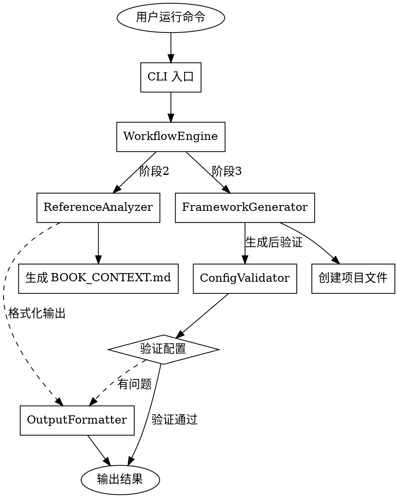

# Book Crafter 用户体验改进设计

**日期**: 2026-03-28
**状态**: 设计阶段
**范围**: 改进 book-crafter 技能的用户体验，修复 7 个已知问题

---

## 问题概述

基于用户反馈，发现以下 7 个问题：

### 关键问题

1. **工作流引擎缺少 CLI 入口**
   - `workflow-engine.mjs` 是模块，没有 CLI 接口
   - 用户需要自己写脚本调用，不够友好

2. **框架生成器的路由配置错误**
   - VitePress 配置中路由路径与实际文件位置不匹配
   - 配置了 `/chapters/chapter-1` 但文件在 `/chapter-01.md`

3. **首页 layout 配置不当**
   - 生成的 `index.md` 使用 `layout: home`
   - 导致内容不显示，需要用 `layout: doc`

### 体验改进

4. **缺少配置验证**
   - 没有验证生成的配置是否正确
   - 用户在浏览器看到 404 或空白页时不知道问题在哪

5. **没有浏览器自动刷新提示**
   - VitePress 配置更新后需要刷新浏览器
   - 但没有任何提示告诉用户

6. **reference-analyzer.mjs 的输出格式**
   - 分析结果只返回文件列表
   - 没有提供如何转换成书籍章节的建议

### 测试完善

7. **缺少端到端测试示例**
   - 有测试文件但可能没有实际测试完整流程
   - 无法发现配置问题

### 功能增强

8. **缺少 Mermaid 图表支持**
   - 需要手动安装和配置 vitepress-plugin-mermaid
   - 大部分技术书籍都需要流程图、时序图等

9. **缺少内容质量验证**
   - 没有检查链接是否有效
   - 没有检查图片是否存在
   - 没有检查章节内容是否完整

---

## 设计方案

采用**模块化重构方案**，创建独立模块，符合现有架构风格。

### 架构概览

**新增模块**：
- `scripts/cli.mjs` - CLI 入口和参数解析
- `scripts/config-validator.mjs` - VitePress 配置验证器和内容质量检查
- `scripts/output-formatter.mjs` - 友好的输出格式化工具

**改进模块**：
- `workflow-engine.mjs` - 保持纯粹的工作流引擎职责，不再混合 CLI 逻辑
- `framework-generator.mjs` - 移除验证逻辑到独立模块，简化职责，修复路由生成，添加 Mermaid 支持
- `reference-analyzer.mjs` - 增强输出格式，添加智能建议
- `templates/vitepress-flat/package.json` - 添加 Mermaid 依赖
- `templates/vitepress-flat/docs/index.md` - 修正 layout 配置
- `templates/vitepress-flat/docs/.vitepress/config.mts` - 修正路由配置模板，启用 Mermaid

**文件结构**：
```
skills/book-crafter/
├── scripts/
│   ├── cli.mjs (新增)
│   ├── workflow-engine.mjs (改进)
│   ├── framework-generator.mjs (改进)
│   ├── config-validator.mjs (新增)
│   ├── output-formatter.mjs (新增)
│   └── reference-analyzer.mjs (改进)
├── templates/
│   └── vitepress-flat/
│       └── docs/
│           ├── index.md (修正 layout)
│           └── .vitepress/
│               └── config.mts (修正路由)
└── tests/
    ├── cli.test.mjs (新增)
    ├── config-validator.test.mjs (新增)
    ├── output-formatter.test.mjs (新增)
    ├── framework-generator.test.mjs (改进)
    └── e2e/
        └── full-workflow.test.mjs (改进)
```

---

## 模块详细设计

### 1. CLI 模块 (`scripts/cli.mjs`)

**职责**：
- 解析命令行参数
- 调用 WorkflowEngine 执行相应操作
- 格式化输出结果
- 处理错误和用户提示

**API 设计**：
```javascript
class CLI {
  constructor() {
    this.engine = null
    this.formatter = new OutputFormatter()
  }

  async run() {
    const { command, options } = this.#parseArgs()
    await this.#executeCommand(command, options)
  }

  #parseArgs() {
    const args = process.argv.slice(2)
    const command = args[0]
    const options = {
      path: args[1] || process.cwd()
    }
    return { command, options }
  }

  async #executeCommand(command, options) {
    this.engine = new WorkflowEngine(options.path)

    switch(command) {
      case 'init':
        await this.engine.init()
        break
      case 'next':
        await this.engine.nextStage()
        break
      case 'resume':
        await this.engine.resume()
        break
      case 'status':
        const state = await this.engine.getState()
        this.formatter.formatWorkflowState(state)
        break
      case '--help':
      case '-h':
        this.#printHelp()
        break
      default:
        this.formatter.error(`未知命令: ${command}`)
        this.#printHelp()
        process.exit(1)
    }
  }

  #printHelp() {
    console.log(`
Book Crafter CLI

用法:
  node scripts/cli.mjs <command> [options]

命令:
  init [path]    初始化工作流 (默认: 当前目录)
  next           执行下一阶段
  resume         恢复执行
  status         查看当前状态
  --help, -h     显示帮助信息

示例:
  node scripts/cli.mjs init /path/to/my-book
  node scripts/cli.mjs next
  node scripts/cli.mjs resume
    `)
  }
}

// 入口
if (process.argv[1].endsWith('cli.mjs')) {
  const cli = new CLI()
  await cli.run()
}
```

**支持的命令**：
```bash
node scripts/cli.mjs init [path]           # 初始化工作流
node scripts/cli.mjs next                  # 执行下一阶段
node scripts/cli.mjs resume                # 恢复执行
node scripts/cli.mjs status                # 查看当前状态
node scripts/cli.mjs --help                # 显示帮助
```

---

### 2. 配置验证器 (`scripts/config-validator.mjs`)

**职责**：
- 验证 VitePress 配置文件的有效性
- 检查路由配置与实际文件的匹配情况
- 验证所有链接指向的文件是否存在
- 检查内部链接有效性（新增）
- 检查图片资源是否存在（新增）
- 验证章节内容完整性（新增）
- 输出验证报告和修复建议

**API 设计**：
```javascript
export class ConfigValidator {
  constructor(projectPath) {
    this.projectPath = projectPath
    this.docsPath = path.join(projectPath, 'docs')
    this.configPath = path.join(this.docsPath, '.vitepress', 'config.mts')
  }

  /**
   * 验证整个配置
   * @returns {Promise<{valid: boolean, errors: Array, warnings: Array}>}
   */
  async validate() {
    const errors = []
    const warnings = []

    try {
      // 1. 验证配置文件存在
      await this.#validateConfigExists()

      // 2. 验证路由配置
      const routerErrors = await this.#validateSidebarLinks()
      errors.push(...routerErrors)

      // 3. 检查 layout 设置
      const layoutErrors = await this.#checkLayoutIssues()
      errors.push(...layoutErrors)

      // 4. 验证文件存在性
      const fileErrors = await this.#validateFilesExist()
      errors.push(...fileErrors)

      // 5. 检查内部链接（新增）
      const linkErrors = await this.#checkInternalLinks()
      errors.push(...linkErrors)

      // 6. 检查图片资源（新增）
      const imageErrors = await this.#checkImages()
      errors.push(...imageErrors)

      // 7. 检查内容完整性（新增）
      const contentWarnings = await this.#checkContentCompleteness()
      warnings.push(...contentWarnings)

    } catch (error) {
      errors.push({
        type: 'CRITICAL',
        message: error.message
      })
    }

    return {
      valid: errors.length === 0,
      errors,
      warnings
    }
  }

  /**
   * 验证侧边栏链接
   * @private
   */
  async #validateSidebarLinks() {
    const errors = []
    const config = await this.#readConfig()
    const sidebar = this.#extractSidebar(config)

    for (const item of sidebar) {
      const link = item.link
      const expectedFile = this.#linkToFile(link)

      const filePath = path.join(this.docsPath, expectedFile)
      try {
        await fs.access(filePath)
      } catch {
        errors.push({
          type: 'BROKEN_LINK',
          message: `链接 ${link} 指向不存在的文件: ${expectedFile}`,
          link,
          expectedFile
        })
      }
    }

    return errors
  }

  /**
   * 检测常见的 layout 问题
   * @private
   */
  async #checkLayoutIssues() {
    const errors = []
    const indexPath = path.join(this.docsPath, 'index.md')

    try {
      const content = await fs.readFile(indexPath, 'utf-8')

      if (content.includes('layout: home')) {
        errors.push({
          type: 'LAYOUT_ISSUE',
          message: 'index.md 使用 "home" layout，内容将不会显示',
          file: 'docs/index.md',
          suggestion: '将 layout 改为 "doc"'
        })
      }
    } catch {
      // index.md 不存在，忽略
    }

    return errors
  }

  /**
   * 验证文件存在性
   * @private
   */
  async #validateFilesExist() {
    const errors = []
    const files = await fg(path.join(this.docsPath, '*.md'))

    for (const file of files) {
      const content = await fs.readFile(file, 'utf-8')
      // 检查文件是否有有效的标题
      if (!content.match(/^#\s+.+/m)) {
        errors.push({
          type: 'MISSING_TITLE',
          message: `文件 ${path.basename(file)} 缺少标题`,
          file
        })
      }
    }

    return errors
  }

  /**
   * 检查内部链接有效性（新增）
   * @private
   */
  async #checkInternalLinks() {
    const errors = []
    const files = await fg(path.join(this.docsPath, '**/*.md'))

    for (const file of files) {
      const content = await fs.readFile(file, 'utf-8')
      // 提取 Markdown 链接 [text](link)
      const linkPattern = /\[([^\]]+)\]\(([^)]+)\)/g
      let match

      while ((match = linkPattern.exec(content)) !== null) {
        const link = match[2]

        // 只检查相对路径链接（不检查外部链接）
        if (!link.startsWith('http://') && !link.startsWith('https://')) {
          const targetPath = path.resolve(path.dirname(file), link)

          try {
            await fs.access(targetPath)
          } catch {
            errors.push({
              type: 'BROKEN_INTERNAL_LINK',
              message: `文件 ${path.basename(file)} 中的链接指向不存在的路径: ${link}`,
              file,
              link
            })
          }
        }
      }
    }

    return errors
  }

  /**
   * 检查图片资源（新增）
   * @private
   */
  async #checkImages() {
    const errors = []
    const files = await fg(path.join(this.docsPath, '**/*.md'))

    for (const file of files) {
      const content = await fs.readFile(file, 'utf-8')
      // 提取图片链接 
      const imagePattern = /!\[([^\]]*)\]\(([^)]+)\)/g
      let match

      while ((match = imagePattern.exec(content)) !== null) {
        const src = match[2]

        // 只检查相对路径图片
        if (!src.startsWith('http://') && !src.startsWith('https://')) {
          const imagePath = path.resolve(path.dirname(file), src)

          try {
            await fs.access(imagePath)
          } catch {
            errors.push({
              type: 'MISSING_IMAGE',
              message: `文件 ${path.basename(file)} 引用的图片不存在: ${src}`,
              file,
              image: src
            })
          }
        }
      }
    }

    return errors
  }

  /**
   * 检查内容完整性（新增）
   * @private
   */
  async #checkContentCompleteness() {
    const warnings = []
    const files = await fg(path.join(this.docsPath, '*.md'))

    for (const file of files) {
      const content = await fs.readFile(file, 'utf-8')
      const basename = path.basename(file)

      // 检查是否有待办标记
      if (content.includes('TODO') || content.includes('待编写')) {
        warnings.push({
          type: 'INCOMPLETE_CONTENT',
          message: `文件 ${basename} 包含未完成的内容标记`,
          file
        })
      }

      // 检查内容长度（太短可能不完整）
      const lines = content.split('\n').filter(line => !line.startsWith('#')).length
      if (lines < 5) {
        warnings.push({
          type: 'SHORT_CONTENT',
          message: `文件 ${basename} 内容较少（仅 ${lines} 行），可能不完整`,
          file
        })
      }
    }

    return warnings
  }

  /**
   * 链接转文件路径
   */
  #linkToFile(link) {
    // /chapter-01 -> chapter-01.md
    return link.replace(/^\//, '') + '.md'
  }

  /**
   * 生成修复建议
   */
  generateFixSuggestions(errors) {
    return errors.map(error => {
      switch(error.type) {
        case 'BROKEN_LINK':
          return `修复链接: 将 ${error.link} 改为指向存在的文件`
        case 'LAYOUT_ISSUE':
          return `修改 ${error.file} 的 layout 为 "doc"`
        case 'MISSING_TITLE':
          return `为 ${error.file} 添加标题`
        case 'BROKEN_INTERNAL_LINK':
          return `修复 ${path.basename(error.file)} 中的链接: ${error.link}`
        case 'MISSING_IMAGE':
          return `添加缺失的图片: ${error.image}`
        default:
          return error.message
      }
    })
  }

  async #readConfig() {
    const content = await fs.readFile(this.configPath, 'utf-8')
    return content
  }

  #extractSidebar(config) {
    // 简化实现：正则提取 sidebar 链接
    const links = []
    const linkPattern = /link:\s*['"]([^'"]+)['"]/g
    let match

    while ((match = linkPattern.exec(config)) !== null) {
      links.push({ link: match[1] })
    }

    return links
  }

  async #validateConfigExists() {
    await fs.access(this.configPath)
  }
}
```

---

### 3. 输出格式化器 (`scripts/output-formatter.mjs`)

**职责**：
- 提供统一的输出格式
- 生成进度提示和成功/警告消息
- 格式化分析结果和建议
- 输出浏览器缓存问题的解决方案

**API 设计**：
```javascript
export class OutputFormatter {
  /**
   * 格式化工作流状态
   */
  formatWorkflowState(state) {
    const completed = Object.values(state.stages)
      .filter(s => s.status === 'completed').length

    console.log(`
📊 当前状态: 阶段 ${state.currentStage}/6
   ${state.stages[state.currentStage]?.name || '未知'}

✅ 已完成: ${completed}/6
    `)
  }

  /**
   * 格式化分析结果
   */
  formatAnalysisResult(analysis) {
    console.log(`
📚 分析结果:
   书名: ${analysis.title}
   类型: ${analysis.bookType}
   章节数: ${analysis.chapters.length}

📊 分析建议:
   发现 ${analysis.chapters.length} 个潜在章节
   建议按以下方式组织:
${analysis.chapters.map((ch, i) => `   ${i+1}. ${ch.title}`).join('\n')}
    `)
  }

  /**
   * 生成浏览器缓存问题提示
   */
  formatBrowserCacheTip() {
    console.log(`
⚠️  重要提示：
   如果浏览器显示空白或 404，请：
   1. 按 Cmd+Shift+R (Mac) 或 Ctrl+Shift+F5 (Windows) 强制刷新
   2. 或使用浏览器的隐私/无痕模式访问
    `)
  }

  /**
   * 格式化配置验证结果
   */
  formatValidationResult(result) {
    if (result.valid) {
      this.success('配置验证通过')
      return
    }

    console.log(`\n🔍 配置验证报告\n`)

    if (result.errors.length > 0) {
      console.log(`❌ 发现 ${result.errors.length} 个错误:`)
      result.errors.forEach((err, i) => {
        console.log(`  ${i+1}. ${err.message}`)
      })
    }

    if (result.warnings.length > 0) {
      console.log(`\n⚠️  发现 ${result.warnings.length} 个警告:`)
      result.warnings.forEach((warn, i) => {
        console.log(`  ${i+1}. ${warn.message}`)
      })
    }
  }

  /**
   * 成功消息
   */
  success(message) {
    console.log(`\n✅ ${message}\n`)
  }

  /**
   * 警告消息
   */
  warn(message) {
    console.log(`⚠️  ${message}`)
  }

  /**
   * 错误消息
   */
  error(message) {
    console.log(`❌ ${message}`)
  }

  /**
   * 信息消息
   */
  info(message) {
    console.log(`ℹ️  ${message}`)
  }

  /**
   * 步骤消息
   */
  step(number, total, message) {
    console.log(`\n📍 步骤 ${number}/${total}: ${message}`)
  }
}
```

---

### 4. 现有模块改进

#### 4.1 workflow-engine.mjs 改进

**改动**：
- 保持纯粹的工作流引擎职责
- **不添加** CLI 代码（由独立的 cli.mjs 处理）
- 添加与 OutputFormatter 的集成

**改进代码**：
```javascript
import { OutputFormatter } from './output-formatter.mjs'

export class WorkflowEngine {
  #projectPath
  #statePath
  #logger
  #state
  #formatter  // 新增

  constructor(projectPath) {
    if (!projectPath || typeof projectPath !== 'string') {
      throw new Error('projectPath 必须是非空字符串')
    }
    this.#projectPath = projectPath
    this.#statePath = path.join(projectPath, '.book-crafter', 'state.json')
    this.#logger = new Logger()
    this.#formatter = new OutputFormatter()  // 新增
    this.#state = null
  }

  async init() {
    // ... 现有代码 ...

    await this.#saveState()
    this.#formatter.success('工作流初始化完成')
    this.#formatter.formatWorkflowState(this.#state)
  }

  async completeStage(stageNumber, output = {}) {
    // ... 现有代码 ...

    await this.#saveState()
    this.#formatter.success(`阶段 ${stageNumber} 完成: ${state.stages[stageNumber].name}`)
    this.#formatter.formatWorkflowState(state)
  }

  async nextStage(input = {}) {
    const state = await this.getState()
    this.#formatter.info(`开始执行阶段 ${state.currentStage}: ${state.stages[state.currentStage].name}`)

    const result = await this.executeStage(state.currentStage, input)
    await this.completeStage(state.currentStage, result.output)

    return result
  }

  async resume() {
    const state = await this.getState()
    this.#formatter.info(`恢复执行，当前阶段: ${state.currentStage}`)
    return await this.nextStage()
  }
}
```

#### 4.2 framework-generator.mjs 改进

**改动**：
- 移除验证逻辑（由独立的 config-validator.mjs 处理）
- 集成 ConfigValidator 和 OutputFormatter
- 修复侧边栏路由生成逻辑

**核心改进**：
```javascript
import { ConfigValidator } from './config-validator.mjs'
import { OutputFormatter } from './output-formatter.mjs'

export class FrameworkGenerator {
  #projectPath
  #analysis
  #logger
  #templatePath
  #validator  // 新增
  #formatter  // 新增

  constructor(projectPath, analysis) {
    // ... 现有验证代码 ...

    this.#projectPath = projectPath
    this.#analysis = analysis
    this.#logger = new Logger()
    this.#validator = new ConfigValidator(projectPath)  // 新增
    this.#formatter = new OutputFormatter()  // 新增

    // 获取模板路径
    const currentDir = path.dirname(fileURLToPath(import.meta.url))
    this.#templatePath = path.join(currentDir, '..', 'templates', 'vitepress-flat')
  }

  async generate() {
    this.#formatter.step(0, 5, '开始生成项目框架')

    // 1. 复制模板文件
    this.#formatter.step(1, 5, '复制模板文件')
    await this.#copyTemplate()

    // 2. 替换占位符
    this.#formatter.step(2, 5, '替换配置占位符')
    await this.#replacePlaceholders()

    // 3. 生成章节文件
    this.#formatter.step(3, 5, '生成章节文件')
    await this.#generateChapterFiles()

    // 4. 配置 VitePress（修正路由）
    this.#formatter.step(4, 5, '配置 VitePress')
    await this.#configureVitePress()

    // 5. 验证配置（新增）
    this.#formatter.step(5, 5, '验证项目配置')
    const validation = await this.#validator.validate()
    this.#formatter.formatValidationResult(validation)

    if (!validation.valid) {
      this.#formatter.warn('配置验证发现问题，建议修复后再启动服务器')
      const suggestions = this.#validator.generateFixSuggestions(validation.errors)
      this.#formatter.warn('修复建议:')
      suggestions.forEach(s => this.#formatter.warn(`  - ${s}`))
    }

    this.#formatter.success('项目框架生成完成')
    this.#formatter.formatBrowserCacheTip()
  }

  /**
   * 配置 VitePress（改进版）
   */
  async #configureVitePress() {
    const configPath = path.join(this.#projectPath, 'docs', '.vitepress', 'config.mts')
    let content = await fs.readFile(configPath, 'utf-8')

    // 1. 替换标题和描述
    content = content
      .replace(/title:\s*"[^"]*"/, `title: "${this.#analysis.title}"`)
      .replace(/description:\s*"[^"]*"/, `description: "${this.#analysis.description}"`)

    // 2. 生成侧边栏配置（修正路由格式）
    const sidebarItems = this.#analysis.chapters.map(ch => {
      const chapterNum = String(ch.number).padStart(2, '0')
      return `{ text: '${ch.title}', link: '/chapter-${chapterNum}' }`
    }).join(',\n          ')

    // 替换侧边栏 items
    content = content.replace(
      /items:\s*\[[\s\S]*?\]/,
      `items: [
          { text: '简介', link: '/' },
          ${sidebarItems}
        ]`
    )

    await fs.writeFile(configPath, content, 'utf-8')
  }
}
```

#### 4.3 reference-analyzer.mjs 改进

**改动**：
- 增强 analyze() 方法的输出
- 添加智能建议生成
- 集成 OutputFormatter

**改进代码**：
```javascript
import { OutputFormatter } from './output-formatter.mjs'

export class ReferenceAnalyzer {
  #formatter

  constructor() {
    this.#formatter = new OutputFormatter()
  }

  async analyze(projectPath) {
    this.#formatter.info('开始分析参考项目...')

    const techStack = await this.detectTechStack(projectPath)
    const structure = await this.analyzeStructure(projectPath)
    const chapters = await this.findChapters(projectPath)
    const language = await this.detectLanguage(projectPath)
    const bookType = this.determineBookType({ techStack, structure, chapters })

    const result = {
      path: projectPath,
      techStack,
      structure,
      chapters,
      language,
      bookType
    }

    // 输出友好的分析结果
    this.#formatter.formatAnalysisResult(result)

    return result
  }
}
```

#### 4.4 模板文件改进

**templates/vitepress-flat/package.json**（添加 Mermaid 支持）：
```json
{
  "name": "my-book",
  "version": "1.0.0",
  "type": "module",
  "scripts": {
    "docs:dev": "vitepress dev docs",
    "docs:build": "vitepress build docs",
    "docs:preview": "vitepress preview docs"
  },
  "devDependencies": {
    "vitepress": "^1.0.0",
    "vitepress-plugin-mermaid": "^2.0.0"
  }
}
```

**templates/vitepress-flat/docs/index.md**（修正 layout）：
```markdown
---
layout: doc
---

# {{{title}}}

欢迎使用 VitePress 创建的技术书籍。

## 关于本书

这是一本使用 Book Crafter Skill 创建的技术书籍。它提供了：

- 清晰的文档结构
- 响应式设计
- 搜索功能
- 暗色主题支持

## 快速开始

1. 克隆仓库
2. 安装依赖：`npm install`
3. 启动开发服务器：`npm run docs:dev`
```

**templates/vitepress-flat/docs/.vitepress/config.mts**（修正路由模板，启用 Mermaid）：
```javascript
import { defineConfig } from 'vitepress'
import { withMermaid } from 'vitepress-plugin-mermaid'

// https://vitepress.dev/reference/site-config
export default withMermaid(defineConfig({
  title: "My Book",
  description: "A technical book powered by VitePress",
  lang: 'zh-CN',

  themeConfig: {
    nav: [
      { text: '首页', link: '/' }
    ],

    sidebar: [
      {
        text: '开始',
        items: [
          { text: '简介', link: '/' }
          // 章节将由 framework-generator 动态添加
        ]
      }
    ],

    search: {
      provider: 'local'
    }
  },

  // Mermaid 配置
  mermaid: {
    // 参考: https://mermaid.js.org/config/setup/modules/mermaidAPI.html#mermaidapi-configuration-defaults
    theme: 'default'
  },

  markdown: {
    lineNumbers: true
  }
}))
```

---

## 测试设计

### 新增测试文件

#### 1. tests/cli.test.mjs

```javascript
import { CLI } from '../scripts/cli.mjs'
import fs from 'fs'
import path from 'path'
import os from 'os'

describe('CLI 模块测试', () => {
  let tempDir
  let originalArgv

  beforeEach(() => {
    tempDir = fs.mkdtempSync(path.join(os.tmpdir(), 'cli-test-'))
    originalArgv = process.argv
  })

  afterEach(() => {
    fs.rmSync(tempDir, { recursive: true, force: true })
    process.argv = originalArgv
  })

  test('应该正确解析 init 命令', async () => {
    process.argv = ['node', 'cli.mjs', 'init', tempDir]
    const cli = new CLI()
    const { command, options } = cli['#parseArgs']()

    expect(command).toBe('init')
    expect(options.path).toBe(tempDir)
  })

  test('应该正确解析 next 命令', async () => {
    process.argv = ['node', 'cli.mjs', 'next']
    const cli = new CLI()
    const { command } = cli['#parseArgs']()

    expect(command).toBe('next')
  })

  test('应该处理无效命令', async () => {
    process.argv = ['node', 'cli.mjs', 'invalid']

    const cli = new CLI()
    const exitSpy = jest.spyOn(process, 'exit').mockImplementation(() => {})

    await cli.run()

    expect(exitSpy).toHaveBeenCalledWith(1)
    exitSpy.mockRestore()
  })

  test('应该显示帮助信息', async () => {
    process.argv = ['node', 'cli.mjs', '--help']

    const cli = new CLI()
    const logSpy = jest.spyOn(console, 'log')

    await cli.run()

    expect(logSpy).toHaveBeenCalledWith(expect.stringContaining('Book Crafter CLI'))
    logSpy.mockRestore()
  })

  test('应该使用当前目录作为默认路径', async () => {
    process.argv = ['node', 'cli.mjs', 'init']
    const cli = new CLI()
    const { options } = cli['#parseArgs']()

    expect(options.path).toBe(process.cwd())
  })
})
```

#### 2. tests/config-validator.test.mjs

```javascript
import { ConfigValidator } from '../scripts/config-validator.mjs'
import fs from 'fs'
import path from 'path'
import os from 'os'

describe('ConfigValidator 测试', () => {
  let tempDir
  let validator

  beforeEach(() => {
    tempDir = fs.mkdtempSync(path.join(os.tmpdir(), 'validator-test-'))
    validator = new ConfigValidator(tempDir)
  })

  afterEach(() => {
    fs.rmSync(tempDir, { recursive: true, force: true })
  })

  async function createProject(structure) {
    const docsPath = path.join(tempDir, 'docs')
    fs.mkdirSync(docsPath, { recursive: true })
    fs.mkdirSync(path.join(docsPath, '.vitepress'), { recursive: true })

    // 创建配置文件
    if (structure.config) {
      fs.writeFileSync(
        path.join(docsPath, '.vitepress', 'config.mts'),
        structure.config
      )
    }

    // 创建 markdown 文件
    for (const file of structure.files || []) {
      fs.writeFileSync(
        path.join(docsPath, file.name),
        file.content
      )
    }
  }

  test('应该检测到路由不匹配', async () => {
    await createProject({
      config: `
export default {
  themeConfig: {
    sidebar: [
      { text: 'Chapter 1', link: '/chapters/chapter-1' }
    ]
  }
}
      `,
      files: [
        { name: 'chapter-01.md', content: '# Chapter 1' }
      ]
    })

    const result = await validator.validate()

    expect(result.valid).toBe(false)
    expect(result.errors).toContainEqual(
      expect.objectContaining({
        type: 'BROKEN_LINK'
      })
    )
  })

  test('应该检测到 layout 问题', async () => {
    await createProject({
      config: `export default {}`,
      files: [
        { name: 'index.md', content: '---\nlayout: home\n---\n# Title' }
      ]
    })

    const result = await validator.validate()

    expect(result.errors).toContainEqual(
      expect.objectContaining({
        type: 'LAYOUT_ISSUE'
      })
    )
  })

  test('应该验证通过的配置', async () => {
    await createProject({
      config: `
export default {
  themeConfig: {
    sidebar: [
      { text: 'Chapter 1', link: '/chapter-01' }
    ]
  }
}
      `,
      files: [
        { name: 'index.md', content: '---\nlayout: doc\n---\n# Title' },
        { name: 'chapter-01.md', content: '# Chapter 1' }
      ]
    })

    const result = await validator.validate()

    expect(result.valid).toBe(true)
    expect(result.errors).toHaveLength(0)
  })

  test('应该生成正确的修复建议', async () => {
    const errors = [
      {
        type: 'BROKEN_LINK',
        message: '链接 /chapters/chapter-1 不存在',
        link: '/chapters/chapter-1',
        expectedFile: 'chapters/chapter-1.md'
      },
      {
        type: 'LAYOUT_ISSUE',
        message: 'index.md 使用 home layout',
        file: 'docs/index.md'
      },
      {
        type: 'BROKEN_INTERNAL_LINK',
        message: '链接不存在',
        file: 'docs/chapter-01.md',
        link: './missing.md'
      },
      {
        type: 'MISSING_IMAGE',
        message: '图片不存在',
        file: 'docs/chapter-01.md',
        image: './images/missing.png'
      }
    ]

    const suggestions = validator.generateFixSuggestions(errors)

    expect(suggestions).toHaveLength(4)
    expect(suggestions[0]).toContain('修复链接')
    expect(suggestions[1]).toContain('layout 为 "doc"')
    expect(suggestions[2]).toContain('./missing.md')
    expect(suggestions[3]).toContain('添加缺失的图片')
  })

  test('应该检测到内部链接错误', async () => {
    await createProject({
      config: `export default {}`,
      files: [
        {
          name: 'chapter-01.md',
          content: '# Chapter 1\n\n[链接](./missing.md)'
        }
      ]
    })

    const result = await validator.validate()

    expect(result.errors).toContainEqual(
      expect.objectContaining({
        type: 'BROKEN_INTERNAL_LINK'
      })
    )
  })

  test('应该检测到缺失的图片', async () => {
    await createProject({
      config: `export default {}`,
      files: [
        {
          name: 'chapter-01.md',
          content: '# Chapter 1\n\n'
        }
      ]
    })

    const result = await validator.validate()

    expect(result.errors).toContainEqual(
      expect.objectContaining({
        type: 'MISSING_IMAGE'
      })
    )
  })

  test('应该警告未完成的内容', async () => {
    await createProject({
      config: `export default {}`,
      files: [
        {
          name: 'chapter-01.md',
          content: '# Chapter 1\n\nTODO: 待补充'
        }
      ]
    })

    const result = await validator.validate()

    expect(result.warnings).toContainEqual(
      expect.objectContaining({
        type: 'INCOMPLETE_CONTENT'
      })
    )
  })
})
```

#### 3. tests/output-formatter.test.mjs

```javascript
import { OutputFormatter } from '../scripts/output-formatter.mjs'

describe('OutputFormatter 测试', () => {
  let formatter
  let logSpy

  beforeEach(() => {
    formatter = new OutputFormatter()
    logSpy = jest.spyOn(console, 'log').mockImplementation()
  })

  afterEach(() => {
    logSpy.mockRestore()
  })

  test('应该正确格式化工作流状态', () => {
    const state = {
      currentStage: 3,
      stages: {
        '1': { name: '初始化', status: 'completed' },
        '2': { name: '分析', status: 'completed' },
        '3': { name: '生成', status: 'pending' },
        '4': { name: '配置', status: 'pending' },
        '5': { name: '创作', status: 'pending' },
        '6': { name: '部署', status: 'pending' }
      }
    }

    formatter.formatWorkflowState(state)

    expect(logSpy).toHaveBeenCalledWith(expect.stringContaining('阶段 3/6'))
    expect(logSpy).toHaveBeenCalledWith(expect.stringContaining('已完成: 2/6'))
  })

  test('应该正确格式化分析结果', () => {
    const analysis = {
      title: 'Test Book',
      bookType: 'documentation',
      chapters: [
        { title: 'Chapter 1' },
        { title: 'Chapter 2' }
      ]
    }

    formatter.formatAnalysisResult(analysis)

    expect(logSpy).toHaveBeenCalledWith(expect.stringContaining('Test Book'))
    expect(logSpy).toHaveBeenCalledWith(expect.stringContaining('2 个潜在章节'))
  })

  test('应该生成浏览器缓存提示', () => {
    formatter.formatBrowserCacheTip()

    expect(logSpy).toHaveBeenCalledWith(expect.stringContaining('Cmd+Shift+R'))
    expect(logSpy).toHaveBeenCalledWith(expect.stringContaining('Ctrl+Shift+F5'))
  })

  test('应该格式化成功的验证结果', () => {
    const result = { valid: true, errors: [], warnings: [] }
    formatter.formatValidationResult(result)

    expect(logSpy).toHaveBeenCalledWith(expect.stringContaining('✅'))
  })

  test('应该格式化失败的验证结果', () => {
    const result = {
      valid: false,
      errors: [{ message: 'Error 1' }],
      warnings: [{ message: 'Warning 1' }]
    }
    formatter.formatValidationResult(result)

    expect(logSpy).toHaveBeenCalledWith(expect.stringContaining('❌'))
  })
})
```

### 改进现有测试

#### tests/framework-generator.test.mjs（添加验证集成测试）

```javascript
describe('FrameworkGenerator 配置验证', () => {
  test('应该生成正确的路由格式', async () => {
    const analysis = {
      title: 'Test Book',
      description: 'Test',
      chapters: [
        { number: 1, title: 'Chapter 1', file: 'chapter-01.md' },
        { number: 2, title: 'Chapter 2', file: 'chapter-02.md' }
      ]
    }

    const generator = new FrameworkGenerator(tempDir, analysis)
    await generator.generate()

    const config = await fs.readFile(
      path.join(tempDir, 'docs', '.vitepress', 'config.mts'),
      'utf-8'
    )

    // 验证路由格式正确
    expect(config).toContain('/chapter-01')
    expect(config).toContain('/chapter-02')
    expect(config).not.toContain('/chapters/chapter-1')
  })

  test('应该修正 layout 设置', async () => {
    const analysis = {
      title: 'Test Book',
      description: 'Test',
      chapters: [{ number: 1, title: 'Chapter 1', file: 'chapter-01.md' }]
    }

    const generator = new FrameworkGenerator(tempDir, analysis)
    await generator.generate()

    const indexMd = await fs.readFile(
      path.join(tempDir, 'docs', 'index.md'),
      'utf-8'
    )

    expect(indexMd).toContain('layout: doc')
    expect(indexMd).not.toContain('layout: home')
  })

  test('应该在生成后验证配置', async () => {
    const analysis = {
      title: 'Test Book',
      description: 'Test',
      chapters: [{ number: 1, title: 'Chapter 1', file: 'chapter-01.md' }]
    }

    const generator = new FrameworkGenerator(tempDir, analysis)
    await generator.generate()

    const validator = new ConfigValidator(tempDir)
    const result = await validator.validate()

    expect(result.valid).toBe(true)
  })
})
```

#### tests/e2e/full-workflow.test.mjs（完善端到端测试）

```javascript
import { WorkflowEngine } from '../../scripts/workflow-engine.mjs'
import { ConfigValidator } from '../../scripts/config-validator.mjs'
import fs from 'fs'
import path from 'path'
import os from 'os'

describe('端到端工作流测试', () => {
  let tempDir
  let engine

  beforeEach(() => {
    tempDir = fs.mkdtempSync(path.join(os.tmpdir(), 'book-crafter-e2e-'))
    engine = new WorkflowEngine(tempDir)
  })

  afterEach(() => {
    fs.rmSync(tempDir, { recursive: true, force: true })
  })

  test('应该完成完整流程并验证配置', async () => {
    // 1. 初始化
    await engine.init()

    // 2. 分析
    const analysis = {
      title: 'E2E Test Book',
      description: 'An end-to-end test book',
      chapters: [
        { number: 1, title: 'Introduction', description: 'Introduction', file: 'chapter-01.md' },
        { number: 2, title: 'Getting Started', description: 'Getting started', file: 'chapter-02.md' }
      ]
    }

    const result2 = await engine.executeStage(2, { analysis })
    await engine.completeStage(2, result2.output)

    // 3. 生成框架
    const result3 = await engine.executeStage(3, result2.output)
    await engine.completeStage(3, result3.output)

    // 4. 验证配置
    const validator = new ConfigValidator(tempDir)
    const validation = await validator.validate()

    expect(validation.valid).toBe(true)

    // 5. 验证文件结构
    expect(fs.existsSync(path.join(tempDir, 'docs', 'chapter-01.md'))).toBe(true)
    expect(fs.existsSync(path.join(tempDir, 'docs', 'chapter-02.md'))).toBe(true)

    // 6. 验证配置内容
    const config = fs.readFileSync(
      path.join(tempDir, 'docs', '.vitepress', 'config.mts'),
      'utf-8'
    )
    expect(config).toContain('/chapter-01')
    expect(config).toContain('/chapter-02')
  })

  test('应该通过 CLI 完成完整流程', async () => {
    // 模拟 CLI 调用
    process.argv = ['node', 'cli.mjs', 'init', tempDir]
    const cli = new CLI()
    await cli.run()

    // 验证初始化成功
    expect(fs.existsSync(path.join(tempDir, '.book-crafter', 'state.json'))).toBe(true)
  })
})
```

### 测试覆盖目标

- **CLI 模块**: 100% 覆盖率
- **ConfigValidator**: 95% 覆盖率
- **OutputFormatter**: 100% 覆盖率
- **FrameworkGenerator**: 提升到 90% 覆盖率
- **端到端测试**: 覆盖所有 6 个阶段 + CLI 入口

---

## 数据流



---

## 关键决策

### 为什么创建独立的 CLI 模块？

**原因**：
- workflow-engine.mjs 保持纯粹的引擎职责，符合单一职责原则
- CLI 逻辑和业务逻辑分离，更易测试
- 未来可以扩展更多 CLI 功能（如交互式向导）

### 为什么创建独立的 ConfigValidator？

**原因**：
- 验证逻辑复杂，应该独立测试
- 可以在不同阶段重用验证逻辑
- 生成清晰的验证报告，帮助用户定位问题

### 为什么创建独立的 OutputFormatter？

**原因**：
- 统一输出格式，提升用户体验
- 避免在各模块中散落 console.log
- 方便未来支持更多输出格式（如 JSON、HTML）

### 为什么扩展 ConfigValidator 而不是创建新模块？

**原因**：
- 链接、图片、内容检查都是"验证"职责，属于同一领域
- 可以在一次验证中输出完整的质量报告
- 避免多个验证器模块的协调问题
- 测试更集中，不需要在多个文件中重复测试

### 为什么修正模板而不是动态生成？

**原因**：
- 模板应该作为"最佳实践"的起点
- 减少运行时代码复杂度
- 用户可以自定义模板

### 为什么默认包含 Mermaid 支持？

**原因**：
- 技术书籍几乎都需要流程图、时序图等
- 安装配置简单，不需要用户手动操作
- 不影响不使用 Mermaid 的书籍（插件可选）

---

## 实施注意事项

### 向后兼容性

- CLI 模块不影响现有的 API 使用方式
- 用户仍可以直接导入 WorkflowEngine 类
- 新增的验证和输出是可选功能

### 错误处理

- 所有新模块都要有完善的错误处理
- CLI 应该捕获所有异常并输出友好提示
- 验证错误不阻止流程继续，只给出警告

### 性能考虑

- ConfigValidator 只在生成后运行一次
- 输出格式化不应该阻塞主流程
- CLI 入口应该快速响应

---

## 未来扩展

### 可能的改进方向

1. **交互式 CLI**: 添加问答式向导
2. **配置修复器**: 自动修复检测到的问题
3. **更多验证规则**: 检查内容质量、链接有效性等
4. **多语言支持**: 支持英文、日文等输出
5. **插件系统**: 允许用户自定义验证规则
6. **智能内容生成**: AI 辅助内容创作
7. **实时预览功能**: 自动启动开发服务器和浏览器
8. **智能源项目分析**: 提取主题、评估难度、建议章节结构
9. **多语言书籍支持**: 翻译辅助和术语管理
10. **书籍模板系统**: 支持教程、参考手册、指南等不同类型
11. **增量更新功能**: 源项目更新后智能合并变更

---

## 参考资料

- [VitePress 配置文档](https://vitepress.dev/reference/site-config)
- [Book Crafter Phase 2 设计](./2026-03-25-book-crafter-phase2-design.md)
- [Book Crafter Phase 1 设计](./2026-03-24-book-crafter-design.md)
